# Crypto tools

A local, single-user crypto research workspace. This is a free beta prototype for paper research only. It uses public market data, cost-aware historical tests, manually entered paper holdings and an optional AI assistant.

**No live trading or orders.** Exchange keys, if you save them locally, are used only for read-only product listings. There is no testnet order execution either. This is information, not financial advice. The user decides. Historical results and model output are not forecasts. Read [DISCLAIMER.md](DISCLAIMER.md).

Licence: GNU Affero General Public License v3.0 (AGPL-3.0). See [LICENSE](LICENSE). Copyright (C) 2026 Stephane Lepain.

## What works today

- User-enabled public spot connectors through ccxt for Kraken, OKX, Bybit, Binance and Coinbase Exchange, subject to access and history limits. Every source starts off.
- Historical hold, SMA crossover, daily weekly-trend and RSI tests with per-fill fees and slippage. Strategy results are compared with timestamp-aligned BTC hold using the same quote currency, starting capital and modeled costs.
- Manual paper holdings valued with an enabled spot connector, plus CSV export. These are not exchange account balances. Different quote currencies are not summed.
- A BYOK assistant and four read-only background workers: research, backtest, risk and reviewer. Supported provider configurations: OpenAI, Anthropic, Mistral, Gemini's compatible endpoint, DeepSeek, OpenRouter and local Ollama. You choose the provider and model; provider charges may apply.
- Neutral staking data from your enabled DefiLlama free/Pro, Lido and Bybit public earn connectors, plus read-only Kraken/Binance/OKX earn adapters tested against official examples, not real keys. Filters, sorting and timestamped SQLite caching preserve unknowns. Not a complete market survey. See [data-source notes](docs/DATA-SOURCES.md).
- Trends from enabled public spot sources: volume leaders and exchange breakdowns, capped/lazy thirty-day volume ratios, recent initiating-side flow, market-list changes and supported public perpetual positioning. Definitions, timestamps, unknowns and volume-distortion notices; [metric methods and limits](docs/TRENDS.md). Test-bench links preselect the actual market for past-behaviour testing only.
- Surge universe 25/50/100 (default 50 per exchange), bounded lazy scanning with visible progress/coverage and reused closed daily candles. Saved neutral stablecoin-pair exclusion defaults on, stablecoin-base exclusion defaults off; both reversible, with a conservative source-linked code list.
- Optional, combinable staking filter presets, editable and saved per single-user workspace. Default view remains unfiltered asset A–Z. Unknown source categories are never guessed from protocol names.
- Password login, optional authenticator TOTP, dark and light themes, in-app feedback and optional usage counters (off by default).

The assistant is instructed to return neutral data rather than recommendations. Model prose remains untrusted. Code limits its tools to public data, timestamped staking/trend snapshots, backtests and paper holdings; UI/tool word tests and a prose word guard are not a fact checker or a complete advice detector; a prompt is not a security boundary.

## Your data, your access

The app supplies connectors, not data or a data subscription. Nothing is enabled by default. In **Data sources**, read the provider’s terms, accept them under your own account and enable only sources you are entitled to use. Acceptance here is not a licence and does not override commercial-use or redistribution restrictions. You are responsible for complying with the provider’s terms.

Onboarding lets you choose sources or skip. With no enabled sources, screens show an empty state and link to Data sources. On upgrade, previously implicit sources become disabled until you accept; a one-time notice explains the change. Disabled sources are never fetched, including through AI tools or historical caches.

Exchange earn keys must be read-only: no trading, transfers or withdrawals. Whitelist your VPS IP at the provider. Binance, OKX and Kraken permission checks refuse unsafe or unverifiable keys before enablement and each fetch. Keys use the existing AI-key encryption vault, are hidden from API responses and deletable. Authenticated adapters are **not yet tested with a real key**; DefiLlama Pro is not tested with a paid key. Public connectors need no key. No exchange balance import or transaction paths exist.

For a hosted tester sandbox, set `CRYPTOTOOLS_SANDBOX=1` before starting Compose. Only keyless data sources can be enabled; key fields are disabled and the backend rejects data credentials. This does not disable AI BYOK. [Connector links and verification limits](docs/DATA-SOURCES.md).

## Install

Prerequisites: Docker Engine or Docker Desktop running with Docker Compose v2, Internet access and a free local port 8080. Windows requires Linux containers. No Git checkout, Node installation or registry login is needed. Images are published for **linux/amd64 and linux/arm64**.

**Read the script first**: [shell installer](install.sh) or [PowerShell installer](install.ps1). These commands download and execute code; review it before running. The installer downloads the versioned Compose file into `$HOME/.cryptotools`, pulls `ghcr.io/stephanelepain-hub/cryptotools:latest` and starts it.

Linux or macOS (Docker must be usable by your account):

```sh
curl -fsSL https://raw.githubusercontent.com/stephanelepain-hub/cryptotools/main/install.sh | sh
```

Windows PowerShell:

```powershell
irm https://raw.githubusercontent.com/stephanelepain-hub/cryptotools/main/install.ps1 | iex
```

Open http://127.0.0.1:8080 on the Docker host. Create a password of at least 12 characters and complete onboarding. No AI key is needed for the test bench or paper portfolio. The installer opens a browser when possible; set `OPEN_BROWSER=0` (shell) or download the PowerShell script and use `-NoBrowser` to disable that.

### Update and stop

Updates pull the image and recreate both services, retaining the `cryptotools_app-data` and `cryptotools_feedback-data` named volumes. Back up both volumes before updating. There is no automatic updater or database recovery UI.

```sh
curl -fsSL https://raw.githubusercontent.com/stephanelepain-hub/cryptotools/main/install.sh | sh -s -- update
```

```powershell
& ([scriptblock]::Create((irm https://raw.githubusercontent.com/stephanelepain-hub/cryptotools/main/install.ps1))) -Update
```

The app binds to loopback. It is not approved for public hosting. Stop without deleting your data:

```sh
docker compose -f "$HOME/.cryptotools/compose.yaml" down
```

PowerShell: `docker compose -f "$HOME/.cryptotools/compose.yaml" down`. Never use `down -v` unless you deliberately want to delete the data volumes.

### Manual Docker Compose alternative

Download and review [compose.yaml](compose.yaml), then run from its directory:

```sh
docker compose pull && docker compose up -d --wait --wait-timeout 180
```

To pin a release instead of `latest`, set `CRYPTOTOOLS_IMAGE=ghcr.io/stephanelepain-hub/cryptotools:0.6.1` (PowerShell: `$env:CRYPTOTOOLS_IMAGE = 'ghcr.io/stephanelepain-hub/cryptotools:0.6.1'`). `APP_PORT` overrides port 8080 and `CRYPTOTOOLS_DIR` overrides the install directory. Repeat any overrides when updating or stopping. The Compose project name and volume names stay `cryptotools`; changing the install directory does not create a separate instance.

## Where data goes

Your database, cached candles, paper holdings, backtest/job records and saved settings stay in Docker volumes on your machine by default. Individual assistant replies are kept in the browser page state, not saved as chat history. The feedback service has its own local volume in this Compose configuration.

There are important exceptions:

- Only enabled sources are contacted over the Internet from your installation. Staking snapshots have a 15-minute persisted refresh/failure cooldown; user-initiated connection tests may fetch outside it. Retrieval and provider observation times are separate; unavailable observations stay unknown. DefiLlama Pro's key is part of its official request URL but is not returned or logged by the app.
- If you enable a hosted AI provider, prompts and requested tool data, including paper holdings, go to that provider. Its terms and retention rules apply. Local Ollama avoids a hosted AI provider but requires a reachable model service and explicit endpoint configuration. Inside Docker, `127.0.0.1` refers to the container, not your host.
- Feedback sends version, screen and what you type to the configured feedback service. The default is local. An overridden `FEEDBACK_URL` can be remote. Never paste private material; the free-text filter is incomplete.
- Optional usage counters send only allowlisted names and counts to the configured feedback service. Opting out stops new counts, not deletion of existing counts.

AI and data-provider keys and TOTP secrets are encrypted at rest. The default randomly generated master key is stored alongside the database in the app volume. Someone who can read both can decrypt them. Back up both together; losing the master key loses access to saved keys. This is not hardware isolation. Authentication recovery and TOTP disable/reset UI are not implemented; retain your authenticator before enabling 2FA. See [SECURITY.md](SECURITY.md).

## Screenshots

Captured on 7 October 2026. Bench screenshots use 365 public Kraken BTC/USDT daily candles from 7 October 2025 to 7 October 2026 (exclusive), SMA 5/20, 10 bps fees and 5 bps slippage per fill. They show one historical test, not a strategy recommendation. Portfolio quantities and costs are paper inputs; displayed quotes are public Kraken prices at the timestamp shown. Details: [docs/screenshots/README.md](docs/screenshots/README.md) and [PROVENANCE.md](PROVENANCE.md).

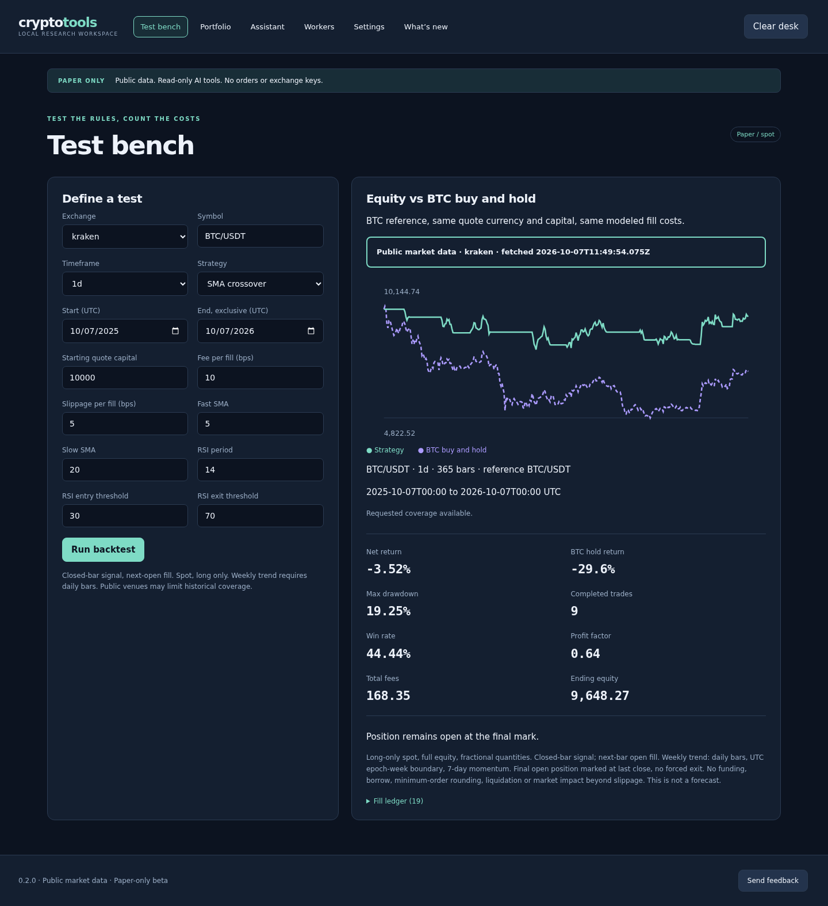

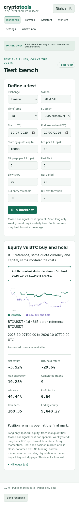

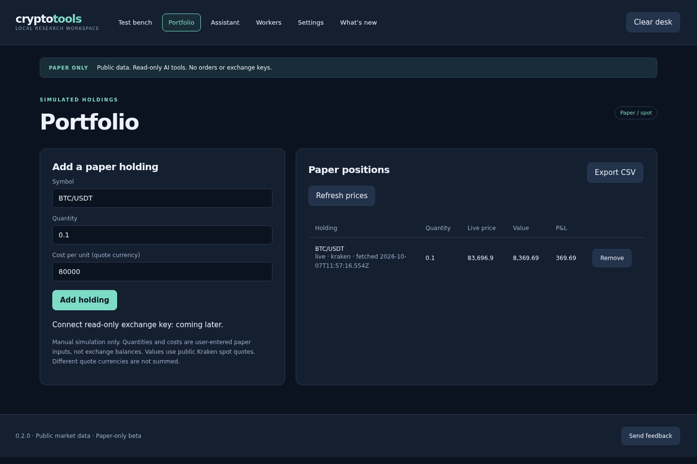

### Source-limited staking information

These 0.4.0 renders use a real anonymous Lido API snapshot fetched on 7 October 2026; the screen shows both retrieval and source-observation ages. APR is the published seven-day average, not compounded APY. Only one verified feed qualifies; absent venues and unknown fields are disclosed, not filled with samples. Details: [staking source notes](docs/STAKING-SOURCES.md).

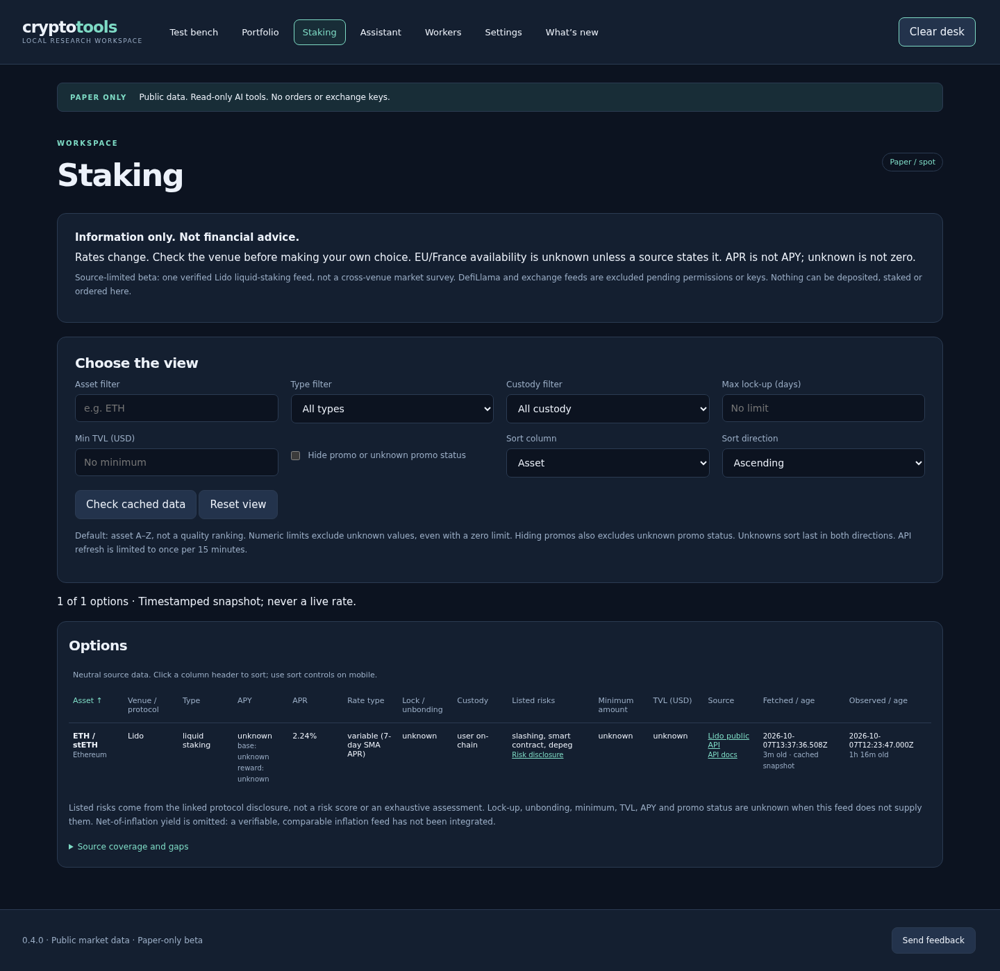

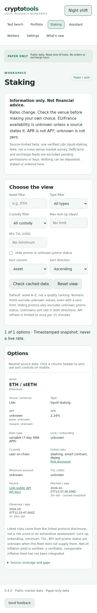

### Bring-your-own-access screens

The 0.5.0 Data sources and empty-state renders show default-off connectors. Staking uses a real free DefiLlama response fetched by the disposable test installation after explicit acceptance, not bundled demo data. This neutral asset-filtered view is not a recommendation.

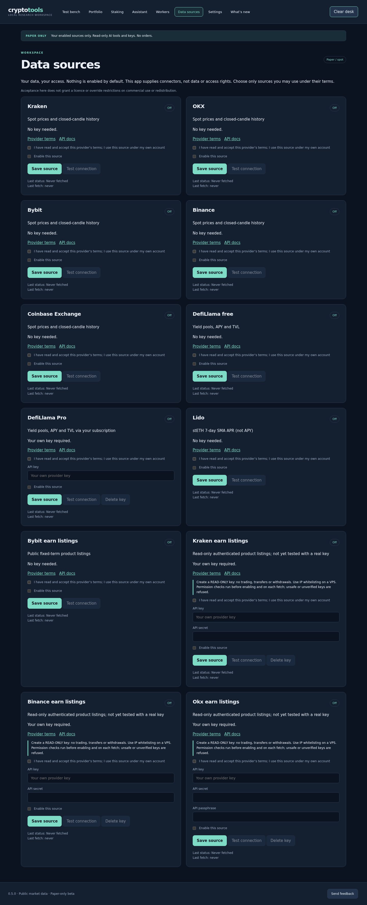

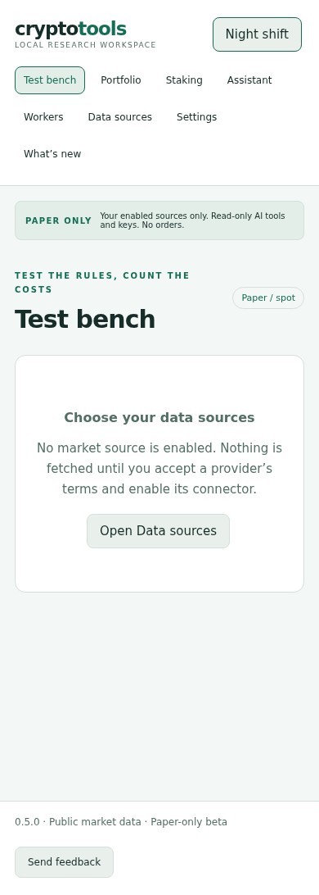

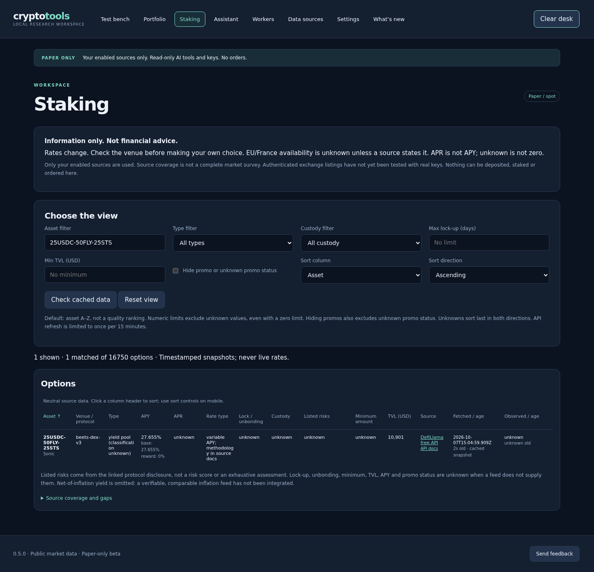

### Observed-activity trends

The 0.6.1 leaders/surges renders use real user-enabled Kraken and OKX public data captured on 7 October 2026 at universe 50, excluding stablecoin-to-stablecoin pairs. Both themes and 390/1440 widths show the wider market universe. The perpetual render remains from 0.6.0. Daily volume ratios use thirty closed daily candles per market, trades show their actual sample coverage, and funding/open interest/basis are public OKX observations. USD stable quotes use a disclosed peg assumption, not verified FX conversion. These snapshots are not data bundled with the app.

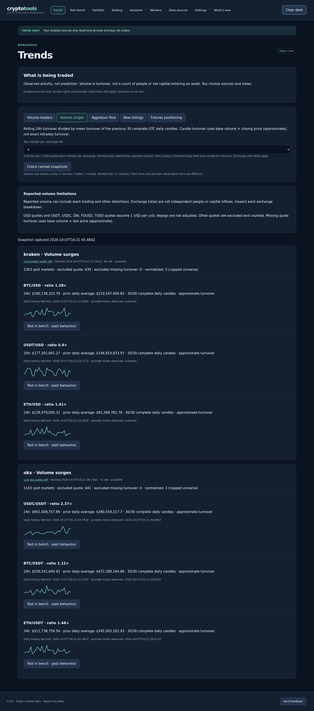



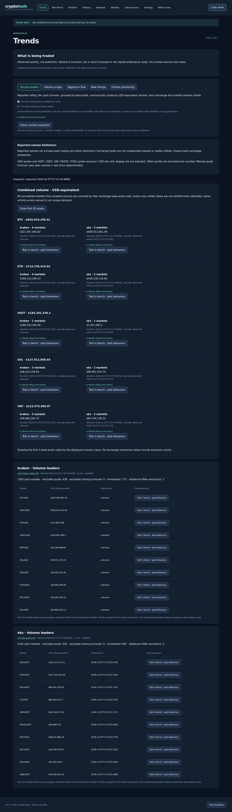

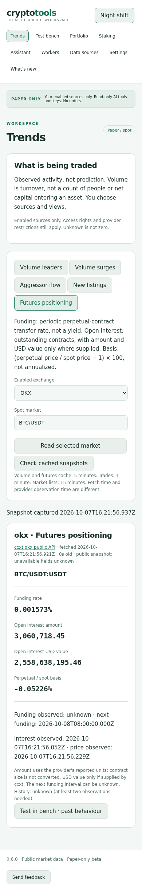

All eight 0.6.1 leaders/surges theme/width captures are in `docs/screenshots/v061-*.png`. Coverage: 50 of 1363 active Kraken markets and 50 of 1143 OKX markets; only eligible USD/stable-quoted markets enter the universe. Long-tail examples include ZEUS, MINA, SAND, SPX and ZRO. Two OKX histories were insufficient; their ratios remain unknown. These counts describe that capture, not fixed exchange coverage.

## Development and test status

Node 22 is required for the built-in SQLite API. From a fresh checkout:

```sh
npm ci && npm test
```

`npm test` builds TypeScript and the frontend before running unit tests. The 0.6.1 implementation passed 74 unit tests in cowork Node 22, adding scheduler concurrency/spacing, partial-failure progress, coalescing, daily-gap/public-bench cache reuse, midnight reuse and conservative stablecoin filters. The 0.6.0 implementation passed 70 unit tests in cowork Node 22, including quote normalization, thirty-day maths, explicit initiating-side mapping, sample coverage, listing diffs, source gates, presets, UI-string scans and both read-only AI tool protocols. Browser integration captures all five metrics, staking presets and the bench link in both themes at 390/1440 using real Kraken/OKX/DefiLlama data. Preset reload persistence and cache hiding on source disable are checked. The 0.5.0 revision passed 51 unit tests and a fresh Docker build, with default-off/terms gates, zero-call disabled-source mocks, encrypted credential and permission-refusal checks, sandbox, strict unknowns and source/bundle transaction-call scans. Browser checks cover both themes at 390/1440: Data sources, onboarding, empty states and real enabled free DefiLlama data. An actual 0.4.0 data volume upgrade preserves password/holdings while disabling sources and hiding old cache. All five keyless spot connectors and public Bybit earn/Lido connection tests returned real data in the Linux VM. The 0.4.0 source revision passed 35 unit tests in a Linux VM, including recorded-real Lido normalization, strict unknown handling, neutral sorting/filtering, cache restart/concurrency/failure/staleness and both AI tool protocols. Staking renders use actual public Lido data in both themes at 390, 768, 1024 and 1440 pixels. Previous focused browser checks covered both themes at 390 and 1440 pixels, real public candles and mocked provider protocols.

**Native Windows and macOS installation are not yet verified.** PowerShell-on-Linux testing is not Windows testing. The arm64 release is checked under QEMU on Linux, not on native ARM hardware. Real hosted AI credentials have not been validated; provider support describes implemented configurations, not a compatibility guarantee.

Browser integration scripts in `tests/` require disposable databases and the fixture services they name. Synthetic candles and fake provider credentials are test fixtures, not public market data or usable API keys. Unknown historical candle provenance is labelled synthetic conservatively. See [PROVENANCE.md](PROVENANCE.md).

Feedback: use the in-app button or [GitHub issues](https://github.com/stephanelepain-hub/cryptotools/issues). For vulnerabilities, use private reporting rather than an issue.
